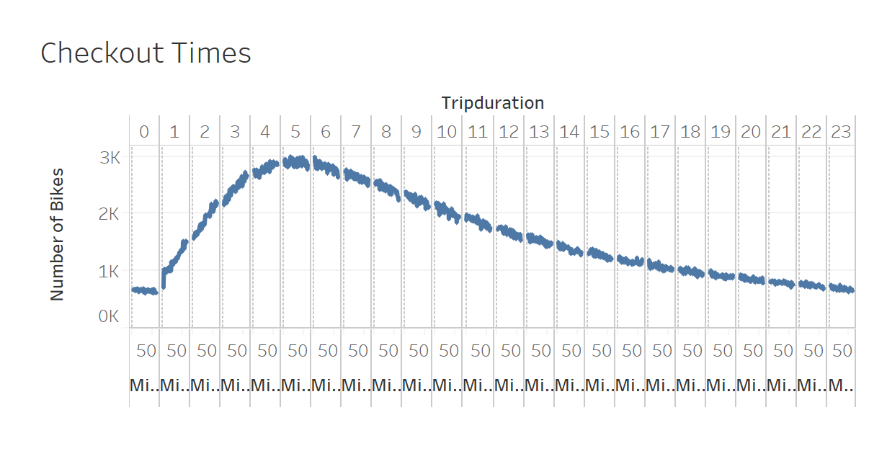
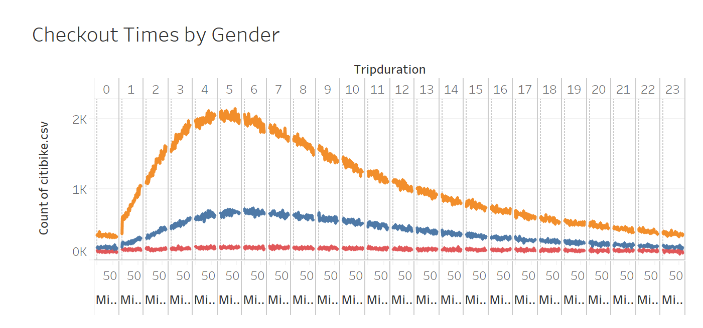
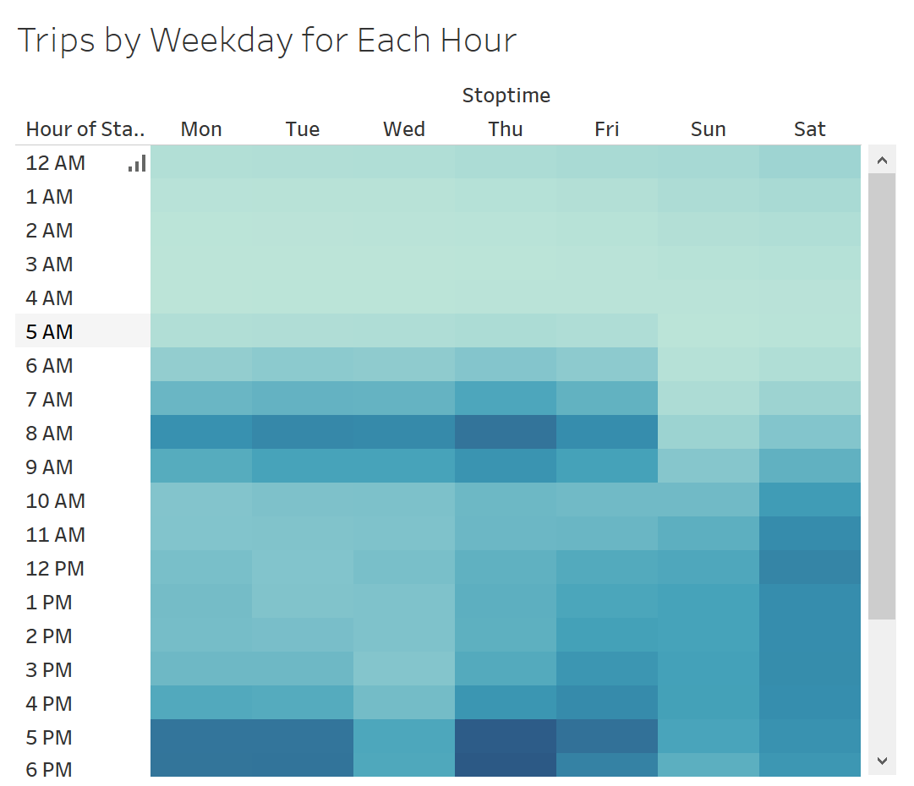
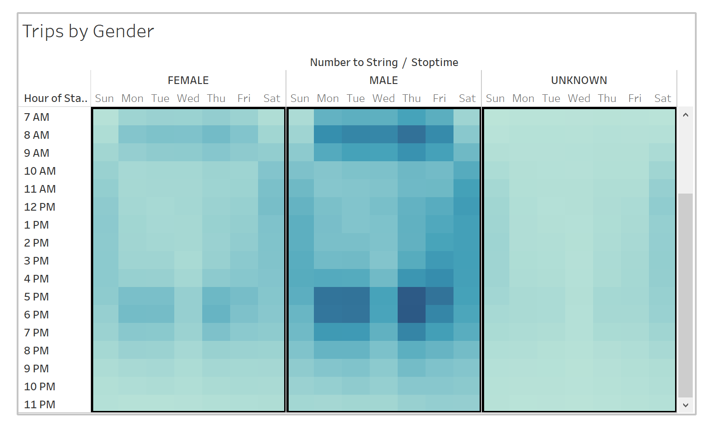
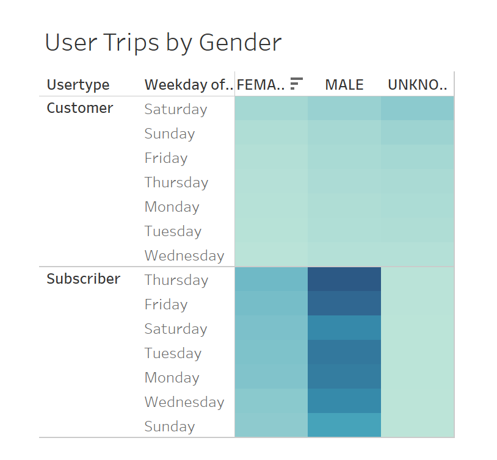

# Bikesharing

## Overview of the Analysis
The purpose of this project is to create an analysis off the NYC bikesharing data to convince investors that a bike sharing program in Des Moines is a solid business proposal. We can use the NYC bikesharing data to create visualizations to analyze the data and see if this business model would work in Des Moines, Iowa. Visualizations and analysis include length of time bikes are checked out for all riders and genders, number of bike trips for all riders/genders for each hour and day of week, and number of bike trips for each type of user and gender for each day of the week. Using this data, we can look at Des Moines demographics and see if this business model would work in this city. 

### Results
 The first visualization we created was to show the length of time that bikes are checked out for all rides. We can see the most popular trip duration time is 5 hours. 
 
 
 
 Next we broke this visualization out by gender. We can see that the most popular trip duration for males was between 4 and 6 hours. The most popular trip duration for females was between 4 and 7 hours.  Unknown was consistent across the board.  
 
 

Next we created a visualization to show trips by weekday for each hour. This chart shows that the most popular time for travel was around 8 am and also 5 and 6 pm. From this we can infer that many people are using this bike sharing program in NYC to commute to work. 

 

 Next we broke out this visualization by gender. Her we can see that females were more across the board when checking out bikes whereas males checked out bikes between 8 am and 5 pm. This shows us males are more likley to bike to work than females.  Weekends also showed moderate usage for both females and males. 
 

Lastly, we created a visualization to analyze user trips by gender. Here we could see if a customer was a customer or a subscriber (monthly subscription), female or male, and what day of the week was the most popular. This graph shows us that the most popular day of the week is Thursday. Male subscribers show a strong significance on this chart during the week days. Whereas customers are stronger on the weekends dipicting this could be a tourist trend. 

### Summary
Using these charts, we can infer that a large portion of this bike sharing program is used by males in NYC that commute to and from work. Over 65% of rides were by males and over 75% of rides were by subscribers. There was a significant amount of rides as well that were on the weekends from the customer segment, that we can assume were tourists. Using both these facts, next steps would be to look at Des Moines, Iowa demographics. First, I'd look to see the percent of males in Des Moines. Next I'd research if Des Moines had a strong public transportation system. Most people in NYC don't have cars and use public transportion to get to and from work. This has a large impact on the bike sharing program in NYC as it seems many males were using the bikes to commute to and from work as subscribers. If most people in Des Moines have cars, they would not need to ride a bike to and from work. But if Des Moines had a busy downtown area and things were in bikeable distance, there may be a chance having a bike sharing program in downtown Des Moines could be successful. Lastly, I'd research to see how many tourists visited Des Moines, Iowa. If Des Moines, was a heavily tourist spot or had sections were tourists visited frequently, then a bike sharing program with stations in specific parts of Des Moines could be successful. If Des Moines has a large population of people who don't own cars, and has a healthy tourist population then I'd recommend a bike sharing program but being extremely strategic where bike stations were located. Other bigger cities I feel would be more successful than Des Moines would be Atlanta, Washington D.C and Chicago based on tourism and percentage of people who own cars. 

In Des Moines, less than 10% of people don't own cars and the average household owns 2 cars. The average commute time in Des Moines is also 18 minutes by car. This could be too far of a commute for people to ride their bikes in Des Moines.  80% of people in Des Moines drove to work where as 10% carpooled.  Compared to NYC where 55% of people use public transit to get to work and only 22% drive to work. The average number of cars in NYC per person is 0.  Knowing this information, if a bike sharing company did extend to Des Moines, I'd suggest changing the business model to not focus on commuters but tourists.  Des Moines has around 14 million visits from tourists a year. NYC has over 60 million. But even with 14 million, a bike sharing company could make profit if focusing purely on tourists and bike locations around the more popular tourist spots.  

Resources:

https://datausa.io/profile/geo/des-moines-ia/#housing

https://datausa.io/profile/geo/new-york-ny#housing

https://www.desmoinesregister.com/story/money/business/2017/12/13/think-no-one-vacations-des-moines-think-again/941870001/

https://www.baruch.cuny.edu/nycdata/tourism/index.html

